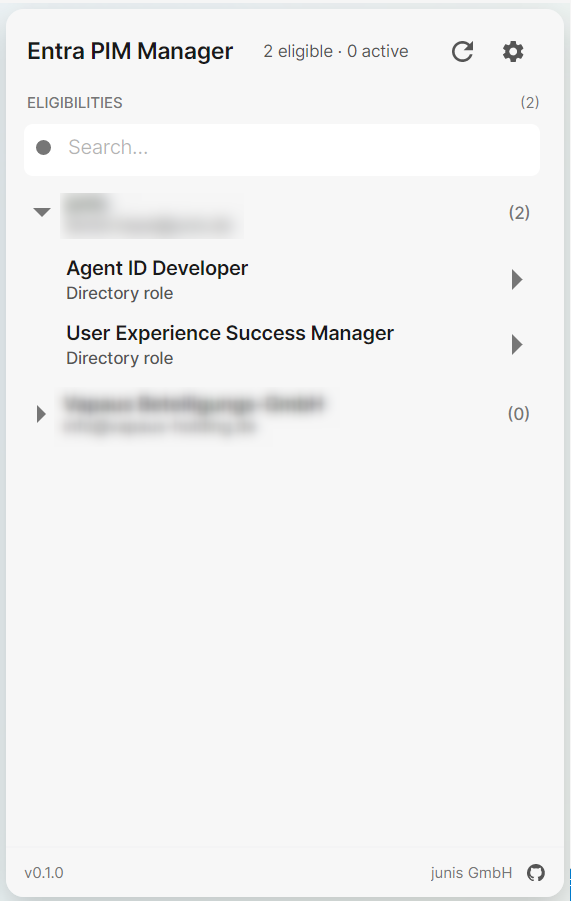
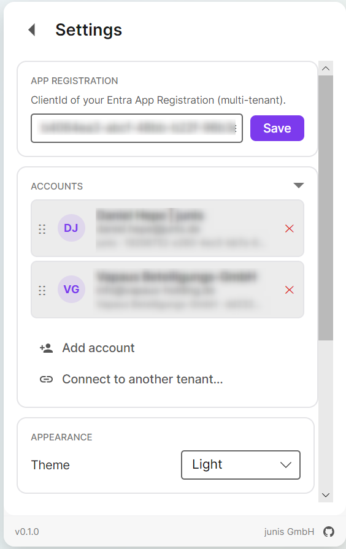
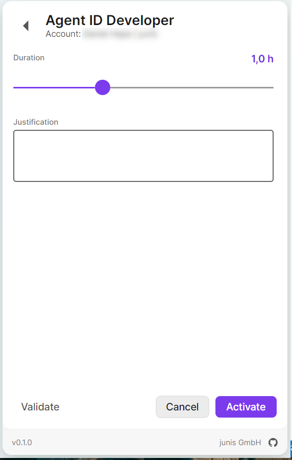

# Entra PIM Manager

A Windows tray application for activating Microsoft Entra Privileged Identity Management (PIM) eligibilities — Directory Roles and Group Memberships — from one place, across multiple tenants, without UAC, admin rights, or service installation.

<p>
  
  
  
</p>

## Features

- One-click activation of Entra PIM eligibilities from the system tray
- Multi-tenant: sign in with multiple admin accounts; eligibilities and active assignments are grouped per tenant
- WAM-broker authentication (no embedded WebView, no in-app password prompts)
- Activation form with justification, ticket reference, and a duration slider in 0.5 h steps (bounded by the per-role policy maximum)
- Live watchdog — the list refreshes automatically when assignments are activated, deactivated, or expire
- Favorites for recurring justifications
- Drag-and-drop reordering of accounts in Settings
- Per-user install to `%LocalAppData%\Programs\Entra-PIM-Manager\` — no UAC, no HKLM, no Windows service
- Optional Windows autostart (enabled by default on first install, toggleable in Settings)
- Velopack-based auto-update

## Requirements

- Windows 10 1809+ or Windows Server 2019+ (required for the WAM broker)
- An Entra tenant with PIM eligibilities assigned to the signed-in user
- A configured Entra App Registration (see [Configure](#configure))

## Install

Download the latest installer from the [Releases](../../releases) page and run it. The installer is per-user — no UAC prompt — and places the app under `%LocalAppData%\Programs\Entra-PIM-Manager\`.

Future updates are downloaded automatically and applied on the next launch.

## Configure

Before first use, an Entra App Registration must be created once (an admin task). Its ClientId is then entered into the app — no file editing required.

Setup steps: [docs/app-registration-setup.md](docs/app-registration-setup.md).

In short:

1. Create a multi-tenant App Registration in your Entra portal.
2. Add the WAM redirect URI `ms-appx-web://microsoft.aad.brokerplugin/{client-id}` and enable public client flows.
3. Grant delegated Graph permissions: `User.Read`, `RoleEligibilitySchedule.Read.Directory`, `RoleAssignmentSchedule.ReadWrite.Directory`, `RoleManagementPolicy.Read.Directory`, `PrivilegedAccess.ReadWrite.AzureADGroup`, `Group.Read.All`.
4. Grant admin consent in every tenant where Entra PIM Manager will be used.
5. Launch the app, open **Settings**, and paste the ClientId. It is saved to your per-user config at `%LocalAppData%\Entra-PIM-Manager\appsettings.local.json` and applied on the next restart — the shipped `appsettings.json` only carries a placeholder.

> Running from source instead of an installer? Copy `src/Entra-PIM-Manager.App.Avalonia/appsettings.local.json.sample` to `appsettings.local.json` and put your `ClientId` there — a developer convenience that avoids retyping it in the UI on every run.

## Build from source

Requires the .NET 8 SDK on Windows.

```powershell
git clone <repo-url>
cd Entra PIM Manager
dotnet restore
dotnet build -c Release -warnaserror
dotnet test
```

To produce a Velopack installer, see [packaging/velopack/README.md](packaging/velopack/README.md).

## Architecture

```text
src/Entra-PIM-Manager.App.Avalonia  →  Avalonia views, ViewModels, tray   (UI only)
src/Entra-PIM-Manager.Core          →  Auth, Graph, models, services      (no UI deps)
src/Entra-PIM-Manager.Tests         →  xUnit, Moq                         (tests against Core only)
```

`Entra-PIM-Manager.Core` does not reference any UI toolkit — that's the layering boundary that keeps tests simple.

## License

MIT — see [LICENSE](LICENSE).

## Contributing

Contributions are welcome — see [CONTRIBUTING.md](CONTRIBUTING.md).

## Security

Found a vulnerability? Please report it privately — see [SECURITY.md](SECURITY.md).
