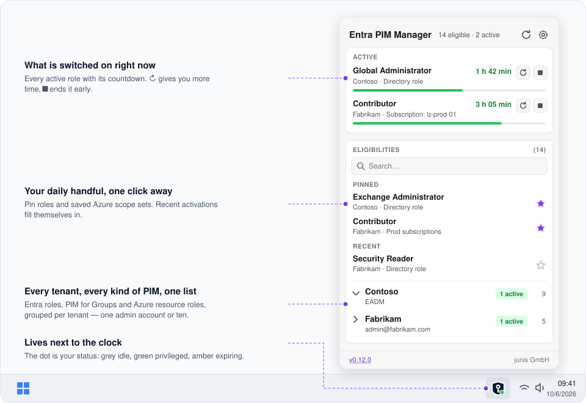
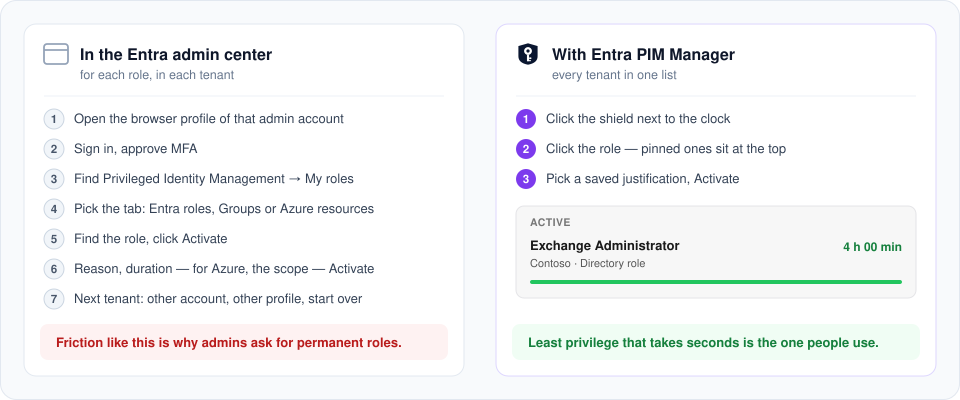
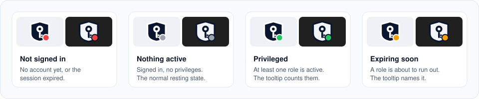
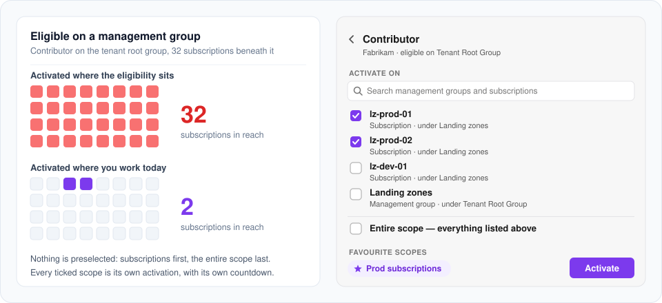
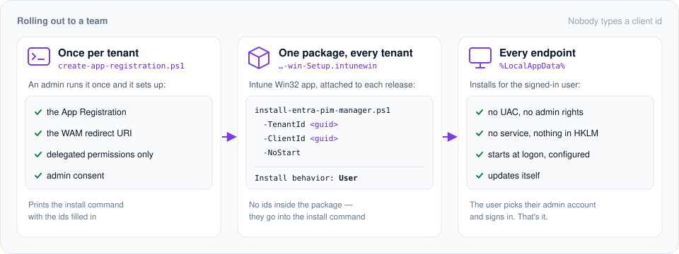

  

<h1 align="center">Entra PIM Manager</h1>

  <b>Just-in-time admin rights, one click from your taskbar — in every tenant you manage.</b> 
  Microsoft Entra PIM for directory roles, groups and Azure resources, as a Windows tray app.

  
  
  

PIM only protects you if people use it. When activating a role means a browser, the portal and
seven steps — per tenant — admins stop activating and start asking for permanent roles. And a
standing admin account is exactly what an attacker hopes to find.

Entra PIM Manager puts every role you are eligible for, in every tenant you work in, behind the
shield next to your clock. Activating takes three clicks, the icon tells you at a glance whether
you are privileged right now, and roles end on their own. Least privilege stops being the slow
option.

| You want to … | Go to |
| --- | --- |
| see why this beats the portal | [Why](#why) |
| install it and activate your first role | [Quick start](#quick-start) |
| learn the app | [User guide](docs/user-guide.md) · [Anleitung auf Deutsch](docs/user-guide.de.md) |
| set up a tenant (admin, once) | [App Registration setup](docs/app-registration-setup.md) |
| roll it out to a team with Intune | [Rolling out to a team](#rolling-out-to-a-team) |
| know what it does on your machine and in your tenant | [Security and footprint](#security-and-footprint) |
| build it or contribute | [CONTRIBUTING.md](CONTRIBUTING.md) |

## Why

| | Entra admin center | PowerShell | Entra PIM Manager |
| --- | --- | --- | --- |
| One role active | seven steps in the browser | connect, look up ids, build a request | three clicks |
| Several tenants | a browser profile per admin account | a Graph and an Azure connection per tenant | one list |
| Entra roles, groups, Azure roles | three tabs | two modules, `Microsoft.Graph` and `Az` | one list |
| "Am I privileged right now?" | open My roles → Active assignments | query it | the colour of the tray icon |
| Before a role expires | — | — | a notification, and the icon turns amber |
| More time on a running role | deactivate, wait, activate again | the same, scripted | **↻ Extend time** does it for you |

## What you get

### Your privilege status, without opening anything

The shield is drawn for your taskbar, light or dark, and only the dot carries a meaning. Shortly
before a role runs out you get a notification, with **↻ Extend time** right on it.

### Every tenant, every kind of PIM, one list

- **Directory roles, PIM for Groups and Azure resource roles** side by side, grouped per tenant.
- **Several admin accounts in several tenants** — a customer's own App Registration, a
  multi-tenant one, or a mix. Global and Entra China (21Vianet) work side by side.
- **Search across everything** — role, type, tenant and Azure scope: a subscription name finds
  its roles.
- **Short aliases** ("EADM") instead of long UPNs, and tenants in the order you drag them.

### Azure roles only where you work

An Azure role held on a management group reaches every subscription below it. The app asks where
to activate it — with nothing ticked, not even the scope the eligibility sits on. Save a set of
scopes under a name, star it, and it waits next to your pinned roles tomorrow.

### Less typing, every day

- **Pinned and recent** — your usual roles and scope sets sit at the top of the panel.
- **Saved justifications** per role. Ticket fields appear only when the role's policy asks for
  them, with the ticket system prefilled per tenant.
- **A duration slider** in half-hour steps, capped by the role's own policy.
- **↻ Extend time** — PIM cannot lengthen a running activation, so the app ends it and requests
  it again for you, prefilled.
- **No surprises** — approval, MFA, and groups that can carry directory roles are flagged before
  you click Activate.
- **A list that keeps itself current** — activations, expiries and roles ended elsewhere show up
  without a refresh.
- **A network check** that probes every endpoint the sign-in needs and copies a report for your
  IT ticket.

## Quick start

1. **Set up the tenant — an admin, once.** Run `scripts/create-app-registration.ps1`, or follow
   the [manual steps](docs/app-registration-setup.md). Either way you end up with a tenant id
   and a client id.
2. **Install.** Download `Entra-PIM-Manager-win-Setup.exe` from
   [Releases](../../releases/latest) and run it. No UAC prompt, nothing to choose.
3. **Connect.** Click the shield next to the clock → **Set up your first tenant** → enter tenant
   id and client id → **Add account** → **Sign in**, and pick your admin account in the Windows
   account picker.

Your eligibilities appear, grouped per tenant. Click one, give a reason, **Activate**.

> [!NOTE]
> **Releases are not code-signed yet.** Windows may warn about an unknown publisher, and
> app-control tools can block the installer. The app offers an update only once it is 72 hours
> old, so security tools have had time to classify it. Status:
> [engineering backlog](docs/engineering-backlog.md#releases-are-not-code-signed--no-signing-exists-anywhere-in-the-pipeline).

## Rolling out to a team

One script per tenant, one Intune Win32 package for all of them — every release carries a
tenant-neutral `.intunewin`. Install and configuration both run in the user's context, and the
next logon starts the app already configured. Arguments, exit codes and the exact Intune values:
[docs/unattended-deployment.md](docs/unattended-deployment.md).

## Security and footprint

This is a privileged-access tool, so here is exactly what it does and does not do.

- **It cannot give you anything you don't already have.** It activates eligibilities someone
  assigned to you. Maximum duration, approval, MFA and ticket rules are enforced by Entra, not by
  the app.
- **Delegated permissions only** — seven Microsoft Graph permissions plus Azure Service
  Management `user_impersonation`, all on behalf of the signed-in user. No client secret, no
  application permissions. [The list, and why each one is needed](docs/app-registration-setup.md#3-api-permissions-delegated).
- **Windows does the sign-in.** The WAM broker handles password, MFA, Windows Hello and
  Conditional Access; the app never sees your password.
- **Clean logs.** No tokens, no justification text, and users appear by object id only.
- **A per-user footprint.** Everything lives under `%LocalAppData%`, and registry entries stay in
  `HKCU` — the uninstall entry and the optional autostart value. No admin rights, no service, no
  scheduled task. Uninstalling removes all of it, cached tokens included.

Found a vulnerability? Please report it privately — see [SECURITY.md](SECURITY.md).

## Requirements

- Windows 10 1809 or Windows Server 2019, or later — the WAM broker needs it.
- Microsoft Entra ID P2 or Entra ID Governance in the tenant — PIM's own licence requirement.
- A role you are eligible for. The app activates; it does not assign.

## Contributing and license

Contributions are welcome — see [CONTRIBUTING.md](CONTRIBUTING.md) for build, conventions and
the PR process. MIT licensed, see [LICENSE](LICENSE). Made by
[junis](https://github.com/junisconsulting).
